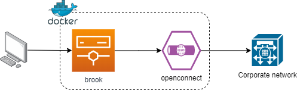

# Proxy through VPN connection in a Docker container


An Alpine Linux container with 

- VPN connection to your corporate network via [`openconnect`](https://github.com/openconnect). `openconnect` can connect to AnyConnect, Pulse and PAN.
- Socks5 proxy with [brook](https://github.com/txthinking/brook)

- The container starts in [`privileged`](https://docs.docker.com/engine/reference/run/#runtime-privilege-and-linux-capabilities) mode in order to avoid the `read-only file system` [error](https://serverfault.com/questions/878443/when-running-vpnc-in-docker-get-cannot-open-proc-sys-net-ipv4-route-flush). Please proceed with your own **risk**.

## Starting the VPN Proxy

### `vpn.config`

The main configuration file. This should be the only file which needs user modifications.

- `SERVER`: VPN endpoint
- `USERNAME`: Login username
- `PASSWORD1`: Login primary password
- `PASSWORD2`: OTP password or prompt response
- `PROXY_PORT`: Proxy port
-`LOCAL_NETWORK` - The CIDR mask of the local IP addresses (e.g. 192.168.0.1/24, 10.1.1.0/24) which will be acessing the proxy. This is so the response to a request can be returned to the client (i.e. your browser).
- `SUSERNAME` - Socks5 username (optional).
- `SPASSWORD` - Socks5 password.

### Start with `docker run`

```Shell
docker build -t ducmthai/openconnect .
docker run -d \
--cap-add=NET_ADMIN \
--device=/dev/net/tun \
--name=vpn_proxy \
--dns=172.25.21.1 --dns=172.25.21.1 \
--privileged=true \
--restart=always \
-v /etc/localtime:/etc/localtime:ro \
-v "$(pwd)"/vpn.config:/vpn/vpn.config:ro \
-p 3129:3129 \
ducmthai/openconnect
```

### Start with `docker-compose`

A `docker-compose.yml` file is also provided:

```Shell
docker-compose up -d
```

## Connecting to the VPN Proxy

Set your proxy to socks5://127.0.0.1:${PROXY_PORT}. Use Socks5 username and password if set.

## Tested environments
- Raspberry Pi 4 B+ (4GB model)
- WSL 2 + Docker WSL2 technical preview (2.1.2.0) + Proxifier